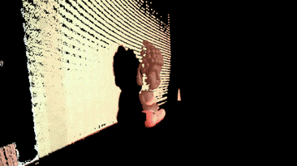
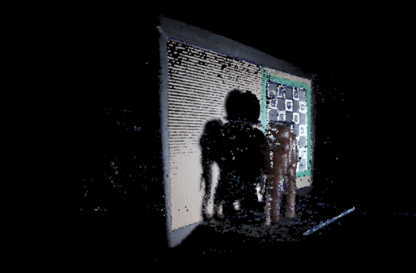

# ift6145-A23-3DScanner

  
   
  

- [ift6145-A23-3DScanner](#ift6145-a23-3dscanner)
  - [Installation](#installation)
  - [Scanner module](#scanner-module)
  - [Application usage](#application-usage)

This repo uses a projector and camera to scan an objet using structured light (Gray codes). The projected patterns are captured by the camera and the 3D points are triangulated using the calibration info of the stereo setup. 

## Installation

1. Make sure python is installed on your System
2. Install all dependencies using the `requirements.txt` file
3. Install scanner module by doing `pip install -e .` in the root of the repo
4. Run the scripts in `src/` in the right order

## Scanner module

The scanner module is used to open a camera with OpenCV, project, capture and decode Gray codes and triangulate the 3d points to make a point cloud.

Here's a list of the packages in this module:
- acquisition : Contains the Camera class to open a webcam on a separate thread
- calibration : Contains 2 classes
    1. CameraCalibrator : Used to calibrate the camera
    2. ProjCamCalibrator : Used to calibrate the projector and the stereo setup (projector + camera)
- grayCode : Functions to create the Gray code images and decode the captured frames
- triangulation : Triangulation class to compute the 3d points based on the camera and projector decoded points
- utils : Visualization functions for the decoding results and the 3d point cloud

## Application usage

The application is located in the `src` folder and works in 4 scripts :

1. calibrate_camera : Use the corresponding variables to set the resolution of the camera and the output path. Run the script to calibrate the camera using the charuco board provided in the repo.
2. calibrate_projcam : Use the corresponding variables to set the resolution of the camera and the projector for the calibration of the stereo setup and the output path. If the projector is already calibrated, the flag `calibrate_proj` cam be set to `False`. 
3. capture_decode : Use the corresponding variables to set the projector resolution for the gray code images and the output path for the captured images and decoded Gray codes.
4. triangulate : Run the script by providing all the right path for the intrinsic parameters of the camera and the projector, the captured image path and the stereo calibration path. The 3D point cloud will open in a separate window.