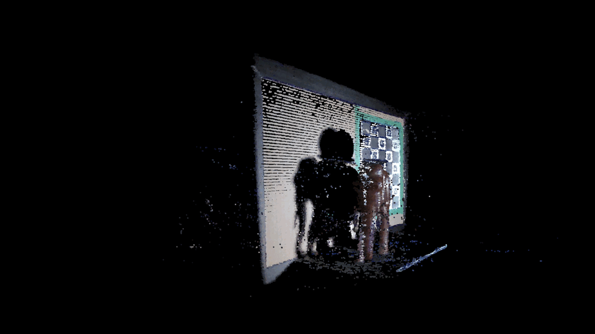

# Structured Light 3D Scanner

<p float="left">
  
   
  
</p>

- [Structured Light 3D Scanner](#structured-light-3d-scanner)
  - [Installation](#installation)
  - [Scanner module](#scanner-module)
  - [Application usage](#application-usage)
  - [Disclaimer](#disclaimer)
  - [Citation](#citation)

This repo uses a projector and camera to scan an objet using structured light (Gray codes). The projected patterns are captured by the camera and the 3D points are triangulated using the calibration info of the stereo setup. The project was made as a final assignment for the IFT6145 class at UdeM.

## Installation

1. Make sure python is installed on your System
2. Install all dependencies using the `requirements.txt` file
3. Install scanner module by doing `pip install -e .` in the root of the repo
4. Run the scripts in `src/` in the right order

## Scanner module

The scanner module is used to open a camera with OpenCV, project, capture and decode Gray codes and triangulate the 3d points to make a point cloud.

Here's a list of the packages in this module:
- **acquisition** : Contains the Camera class to open a webcam on a separate thread
- **calibration** : Contains 2 classes
    1. **CameraCalibrator** : Used to calibrate the camera
    2. **ProjCamCalibrator** : Used to calibrate the projector and the stereo setup (projector + camera)
- **grayCode** : Functions to create the Gray code images and decode the captured frames
- **triangulation** : Triangulation class to compute the 3d points based on the camera and projector decoded points
- **utils** : Visualization functions for the decoding results and the 3d point cloud

## Application usage

The application is located in the `src` folder and works in 4 scripts :

1. **calibrate_camera** : 

Use the corresponding variables to set the resolution of the camera and the output path. Run the script to calibrate the camera using the charuco board provided in the repo.
   
The ChArUco must be printed and glued to a flat surface in order for the calibration to work. Press `k` to run the calibration and `c` to take a picture. Take at least 10 pictures with different angles for the calibration to work (see pictures below):


<p float="left">
  
   
  
</p>

2. **calibrate_projcam** : 

Use the corresponding variables to set the resolution of the camera and the projector for the calibration of the stereo setup and the output path. If the projector is already calibrated, the flag `calibrate_proj` cam be set to `False`. 
   
The circle grid pattern must be projected on the board containg the ChArUco in order for the calibration to work. The pictures will be taken automatically when the board does not move for 5 consecutive frames. Press `k` to calibrate the setup. Take at least 10 pictures with different orientations (as seen in the pictures below):


<p float="left">
  
   
  
</p>

3. **capture_decode** : 

Use the corresponding variables to set the projector resolution for the gray code images and the output path for the captured images and decoded Gray codes. The pictures will be taken automatically each 0.3 seconds, but if the camera is not fast enough, change the variable `wait_time` to the desired value.

4. **triangulate** : 

Run the script by providing all the right path for the intrinsic parameters of the camera and the projector, the captured image path and the stereo calibration path. The 3D point cloud will open in a separate window.

## Disclaimer

This repository is for educational purposes only. The code and algorithm implemented are derived from the original authors' repositories and papers. All rights are reserved to the original authors of the papers and repositories this code is based on.

## Citation

If you find this work useful, please ensure that you cite the original authors:
```
@inproceedings{3D-Modeling,
	author = {Xu, Yi and Aliaga, Daniel G.},
	title = {Robust Pixel Classification for 3D Modeling with Structured Light},
	booktitle = {Proceedings of Graphics Interface 2007},
	series = {GI '07},
	year = {2007},
	isbn = {978-1-56881-337-0},
	location = {Montreal, Canada},
	pages = {233--240},
	numpages = {8},
	acmid = {1268556},
	publisher = {ACM},
	address = {New York, NY, USA},
	keywords = {3D reconstruction, direct and global separation, structured light},
} 

@INPROCEEDINGS{calib, 
	author={D. Moreno and G. Taubin}, 
	booktitle={2012 Second International Conference on 3D Imaging, Modeling, Processing, Visualization Transmission}, 
	title={Simple, Accurate, and Robust Projector-Camera Calibration}, 
	year={2012}, 
	volume={}, 
	number={}, 
	pages={464-471}, 
	doi={10.1109/3DIMPVT.2012.77}, 
	ISSN={1550-6185}, 
	month={Oct},}

@inproceedings{NayarSeperation,
	author = {Nayar, Shree K. and Krishnan, Gurunandan and Grossberg, Michael D. and Raskar, Ramesh},
	title = {Fast Separation of Direct and Global Components of a Scene Using High Frequency Illumination},
	booktitle = {ACM SIGGRAPH 2006 Papers},
	series = {SIGGRAPH '06},
	year = {2006},
	isbn = {1-59593-364-6},
	location = {Boston, Massachusetts},
	pages = {935--944},
	numpages = {10},
	acmid = {1141977},
	publisher = {ACM},
	address = {New York, NY, USA},
	keywords = {coded illumination, direct illumination, global illumination, image decomposition, image manipulation, interreflections, subsurface scattering, translucency, volumetric scattering},
} 
```